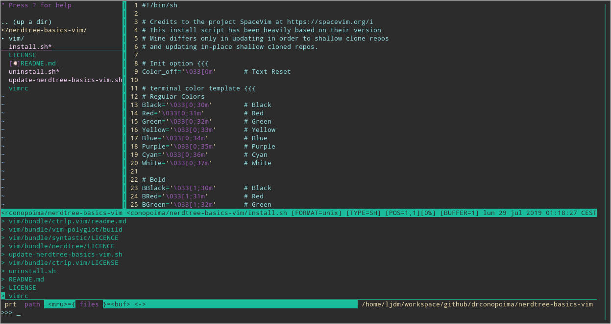

# Nerdtree basics vim
A Vim configuration with NERDTree, Syntastic, Ctrl-P, Vim-Polyglot, Pathogen. Platform independent save as superuser mapper as :W! and :w!!.

This Vim installation is intended to provide just basic commonly used plugins and support for a huge selection of programming languages in order to use as an starting point for generating your own preferred configuration, while still being stronly set up for most use cases. Let NBV be a stepping stone towards building your preferred setup.



Nerdtree Basics Vim installs the latest versions of the following plugins:

* [Pathogen](https://github.com/tpope/vim-pathogen/) as Vim package manager.
* [NERDTree](https://github.com/scrooloose/nerdtree) for file system explorer.
* [NERDTree Git Plugin](https://github.com/Xuyuanp/nerdtree-git-plugin) for NERDTree to show git status flags.
* [Ctrl.P Vim](https://github.com/ctrlpvim/ctrlp.vim) Full path finder (file, path, buffer, mru, tag)
* [Vim Polyglot](https://github.com/sheerun/vim-polyglot) Collection of language packs for Vim.
* [Syntastic](https://github.com/vim-syntastic/syntastic) Syntax checking plugin for Vim

This distribution includes a platform-independent command mapping to save as superuser (for when file is not opened as `sudo`) that works with any filename (special symbols and spaces included).

You just type as command `:W!` or `:w!!` and vim will autocomplete save as SuperUser function. You will be asked your sudo password upon pressing enter.

It also sets the line numbers by default and includes a couple of commonly used options found at this [Introduction to Vim Customization](https://www.linode.com/docs/tools-reference/tools/introduction-to-vim-customization/).

# Installation

To install Nerdtree basics vim, you would need to execute the `install.sh` shell script from the repo, as follows:

Using curl:

```sh
    curl -o- https://raw.githubusercontent.com/drconopoima/nerdtree-basics-vim/master/install.sh | sh
```

Or using wget:
```sh
    wget -qO- https://raw.githubusercontent.com/drconopoima/nerdtree-basics-vim/master/install.sh | sh
```

## Requirements:

* Git
* Vim 7.3 or greater. Vim 8.0 or greater.

The installer will backup any existing Vim configuration to `~/.vim_backup` and install Nerdtree Basics Vim into folder: `~/.vim_nerdtree_basics` and creating links for `~/.vimrc`, for file `pathogen.vim` at `~/.vim/autobundles/` and for individual plugins folders at `~/.vim/bundles/`.

You can install future plugins and customize your installation by cloning plugin repositories into `~/.vim/bundle`.

Behind-the-scenes the installer is simply recursively shallow cloning the repositories for each of the plugins, so as to be efficient in disk space. The update script is additionally updating in parallel all shallow clones in-place and to the latest commit in the master branch, so it is as quick as it can possibly be.

# Updating configuration and plugins

The install script will safely update your existing installation if you have one in place.

You may prefer to use the standalone update script to update your installation:

Curl:
```sh
    curl -o- https://raw.githubusercontent.com/drconopoima/nerdtree-basics-vim/master/update-nerdtree-basics-vim.sh | sh
```

Wget:
```sh
    wget -qO- https://raw.githubusercontent.com/drconopoima/nerdtree-basics-vim/master/update-nerdtree-basics-vim.sh | sh
```

# Uninstall

To uninstall, you have available an uninstall script at the repository root:

Curl:
```sh
    curl -o- https://raw.githubusercontent.com/drconopoima/nerdtree-basics-vim/master/uninstall.sh | sh
```

Wget:
```sh
    wget -qO- https://raw.githubusercontent.com/drconopoima/nerdtree-basics-vim/master/uninstall.sh | sh
```

# Credits

Huge thanks to [SpaceVim](https://spacevim.org) for their awesome install script. Mine only consists of a few modifications to be able to shallow clone and update shallow clones in-place
Huge thanks to all of the authors, maintainers and community behind NERDTree, Pathogen and each of the plugins.
Huge thanks to [spf13](github.com/spf13/spf13.git) for the quick-and-dirty uninstall script.

# Contributing

Thanks for contributing to Nerdtree Basics Vim!

Pull requests and [issue tracking](https://github.com/drconopoima/nerdtree-basics-vim/issues) are welcomed.

However, before submitting, please review the following:

For bug reports:

* Please make sure the bug is reproducible, and give the steps to reproduce it, so that it is easy to dig into the problem.
* Please give us as much detail as possible about your environment (your platform & OS version, Vim version), so we can more easily confirm the problem.

For pull requests:

* Please ensure your commit messages are descriptive of what you are doing. I reject PR with bad commit messages. Don't worry, to change something, `git commit --amend`

# Copyright

Luis J. Díaz. MIT License.

# Self-promotion

If you're feeling charitable, follow me on [Twitter](https://twitter.com/drconopoima) and [GitHub](https://github.com/drconopoima).
